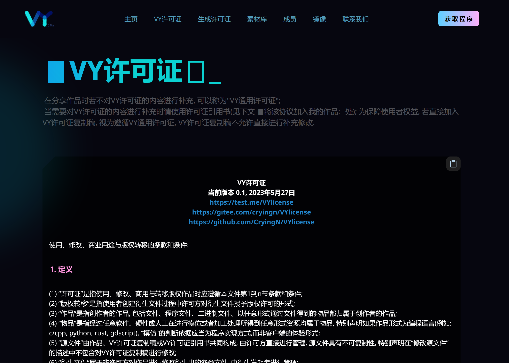
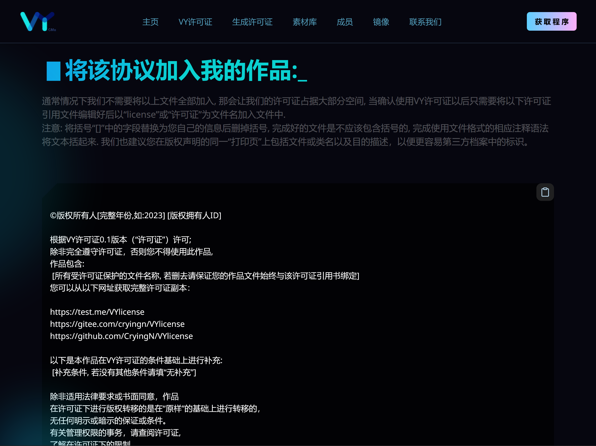

# VY许可证
当前版本 0.1, 2023年5月27日 
https://test.me/VYlicense 
https://gitee.com/cryingn/VYlicense 
https://github.com/CryingN/VYlicense 
使用、修改、商业用途与版权转移的条款和条件:
### 1. 定义
(1) “许可证”是指使用、修改、商用与转移版权作品时应遵循本文件第1到n节条款和条件; 
(2) “版权转移”是指使用者创建衍生文件过程中许可方对衍生文件授予版权许可的形式; 
(3) “作品”是指创作者的作品, 包括文件、程序文件、二进制文件、以任意形式通过文件得到的物品都归属于创作者的作品; 
(4) “物品”是指经过任意软件、硬件或人工在进行模仿或者加工处理所得到任意形式资源均属于物品, 特别声明如果作品形式为编程语言(例如: c/cpp, python, rust, gdscript), “模仿”的判断依据应当为程序实现方式,而非客户端的体验形式; 
(5) “源文件”由作品、VY许可证复制稿或VY许可证引用书共同构成, 由许可方直接进行管理, 源文件具有不可复制性, 特别声明在“修改源文件”的描述中不包含对VY许可证复制稿进行修改; 
(6) “衍生文件”属于非许可方对作品进行修改衍生出的各类文件, 由衍生发起者进行管理; 
(7) “标志”是指创作者所认可用于指代身份的形式, 包括但不限于以汉字、拼音、英文、数字、字头或图形形式充当标志, 在无特别声明的情况下标志为“VYCMa”与VYCMa的社标; 
(8) “创作者”指作品的创作人, 通常也是源文件的许可方, 当许可方并非创作者时, 许可方视为创作者的代理人, 当创作者明确对许可方进行授权, 许可方可以以创作者身份对源文件进行管理; 
(9) “许可方”是源文件的直接管理人; 
(10) “贡献者”是指受许可方允许, 参与后续作品的加工工作; 
(11) “使用者”是指遵守相关法律法规, 遵循许可证使用、修改、商用与版权转移作品的用户.
### 2.授予版权许可
根据本许可证的条款和条件: 
(1) 由许可方进行甄别, 每次独立地授予贡献者永久的、全球性的、非排他性的、免费的、免版税的、不可撤销的版权许可用于修改源文件; 
(2) 授予使用者永久的、全球性的、非排他性的、免费的、免版税的、不可撤销的版权许可用于使用、修改、商用作品与版权转移衍生文件; 
(3) 授予使用者永久的、全球性的、非排他性的、免费的、免版税的、不可撤销的版权许可用于以任意形式标注标志. 
### 3.授予专利许可
依照本许可证的条款和条件: 
针对贡献者对源文件做出的修改授予对应贡献者永久的、全球性的、非排他性的、免费的、免版税的、不可撤销的专利许可用以制作、已制作、使用、出售要约、出售、进口或以其他方式转让修改成果; 
如果许可仅适用于可由该贡献者许可的专利权利要求, 仅因其贡献或他们的贡献与这些工作的结合提交了贡献。如果您对以下内容提起专利诉讼任何实体包 (括诉讼中的交叉申索或反诉) 声称“作品或作品中包含的贡献构成”直接或间接造成专利侵权, 则任何专利许可根据本许可证授予您的该作品的许可将于这样的诉讼被提起。 
### 4.版权转移
对版权转移详细事宜进行补充: 
(1) 使用者可以将作品或部分作品复制为衍生文件, 对衍生文件进行或不进行修改后发布在任意媒体; 
(2) 若衍生文件在作品中以编程语言形式进行引用, 需要标注引用作品的代码位置; 
(3) 若衍生文件在作品中以图像形式进行引用, 需要标识出整个图像文件, 即使对图像进行过修改; 
(4) 若衍生文件在作品中以音频形式进行引用, 需要标识出整个音频文件, 即使对音频进行过修改; 
(5) 除非另作规定, 版权转移后许可方对衍生文件不再拥有处置权; 
### 5.标志
本许可证允许许可方提供标志: 
(1) 当许可方提供标志时, 使用者在对作品进行使用、修改、商用时需要在使用场景对许可方提供的标志进行标注; 
(2) 当使用者创建衍生文件时, 需要在使用场景对许可方提供的标志进行标注, 且有义务标识出引用作品部分内容及许可证中使用者应尽义务, 对于源文件中存在的作品, 标志条款不随版权转移作品而转移许可方权限; 
(3) 当标志中包含商标时, 视为许可方获得商标注册人明确许可, 允许使用者永久的、全球性的、非排他性的、免费的、免版税的、不可撤销的引用许可方所提供商标, 并且需要商标注册人另外出具对应的许可证; 
(4) 当标志中包含商标且许可方未提供商标注册人对商标永久的、全球性的、非排他性的、免费的、免版税的、不可撤销的引用许可证明的特殊情况下, 使用者在使用中不需要在使用场景对标志进行标注. 
以上为全部条款和条件.

# 许可证引用书
©版权所有人[完整年份,如:2023] [版权拥有人ID] 
 
根据VY许可证0.1版本（“许可证”）许可; 
除非完全遵守许可证，否则您不得使用此作品, 
作品包含: 
 [所有受许可证保护的文件名称, 若删去请保证您的作品文件始终与该许可证引用书绑定] 
您可以从以下网址获取完整许可证副本： 
 
https://test.me/VYlicense 
https://gitee.com/cryingn/VYlicense 
https://github.com/CryingN/VYlicense 
 
以下是本作品在VY许可证的条件基础上进行补充: 
 [补充条件, 若没有其他条件请填“无补充”] 
 
除非适用法律要求或书面同意，作品 
在许可证下进行版权转移的是在“原样”的基础上进行转移的， 
无任何明示或暗示的保证或条件。 
有关管理权限的事务，请查阅许可证, 
了解在许可证下的限制。 

# 样例展示

